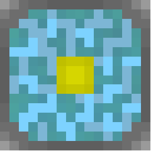

Reactium is a Minecraft: Bedrock Edition server software, forked from [PowerNukkitX](https://github.com/PowerNukkitX/PowerNukkitX).

It carries over PowerNukkitX's full item/block coverage and performance-oriented architecture, rebranded under the Reactium name. The focus for now is on identity and polish rather than trimming content.

## Philosophy

- **Built on proven ground** — Reactium inherits PowerNukkitX's performance-oriented architecture rather than starting from scratch.
- **Open and modifiable** — released as open source so the community can extend, fork, and adapt it.

## Status

🚧 Early development / actively forked from PowerNukkitX. Expect missing features and breaking changes while the project stabilizes.

## Comparison

| | Reactium | PowerNukkitX | BDS | Endstone |
|---|---|---|---|---|
| Base | PowerNukkitX fork | — | Official | BDS-based |
| Item/Block coverage | Full (inherited from PNX) | Extensive | Full (vanilla) | Full (vanilla) |
| Philosophy | Rebranded PNX derivative | Feature-rich | Official reference | Plugin API layer over BDS |

## Installation

*(Add build/run instructions here once available.)*

```bash
git clone https://github.com/SchleroMC/Reactium.git
cd Reactium
# build instructions TBD
```

## Contributing

Contributions are welcome! Since Reactium favors a minimal item/block set, please open an issue to discuss significant additions before submitting a PR, so we can keep the scope aligned with the project's goals.

## License

This project is a fork of PowerNukkitX and retains its original license. See [LICENSE](LICENSE) for details.

## Credits

- [PowerNukkitX](https://github.com/PowerNukkitX/PowerNukkitX) — the base this project is forked from
- [Nukkit](https://github.com/CloudburstMC/Nukkit) — original project PowerNukkitX itself derives from
